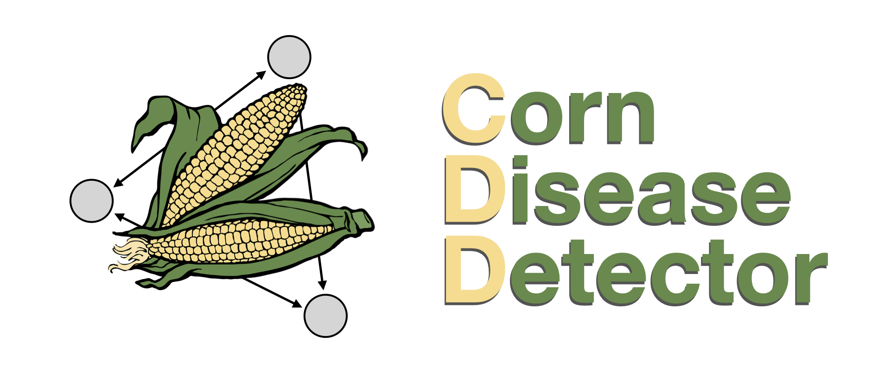

## Welcome to CDD Main Page



Maize is an important crop for the food security of many regions of the world. This species is affected by many plagues and diseases, such as the Common Rust and the Northern Blight, both caused by fungi. There have been many efforts to store information about diseases in databases for machine learning purposes. Perhaps, one of the most useful kinds of information we have about diseases are labeled picture databases. 

### Markdown

Markdown is a lightweight and easy-to-use syntax for styling your writing. It includes conventions for

```markdown
Syntax highlighted code block

# Header 1
## Header 2
### Header 3

- Bulleted
- List

1. Numbered
2. List

**Bold** and _Italic_ and `Code` text

[Link](url) and 
```

For more details see [GitHub Flavored Markdown](https://guides.github.com/features/mastering-markdown/).

### Jekyll Themes

Your Pages site will use the layout and styles from the Jekyll theme you have selected in your [repository settings](https://github.com/corndiseasedetector/corndiseasedetector.github.io/settings/pages). The name of this theme is saved in the Jekyll `_config.yml` configuration file.

### Support or Contact

Having trouble with Pages? Check out our [documentation](https://docs.github.com/categories/github-pages-basics/) or [contact support](https://support.github.com/contact) and we’ll help you sort it out.
